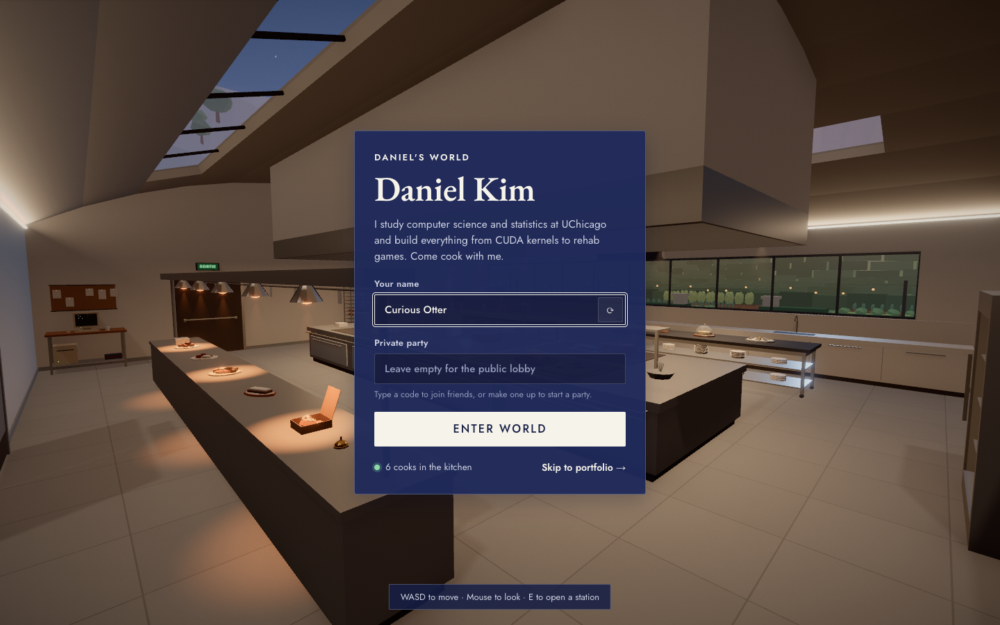
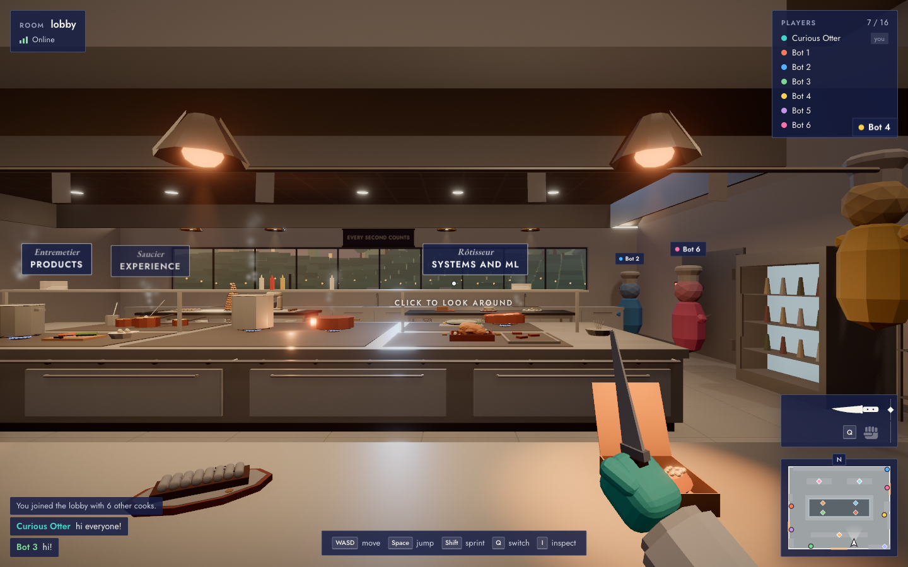
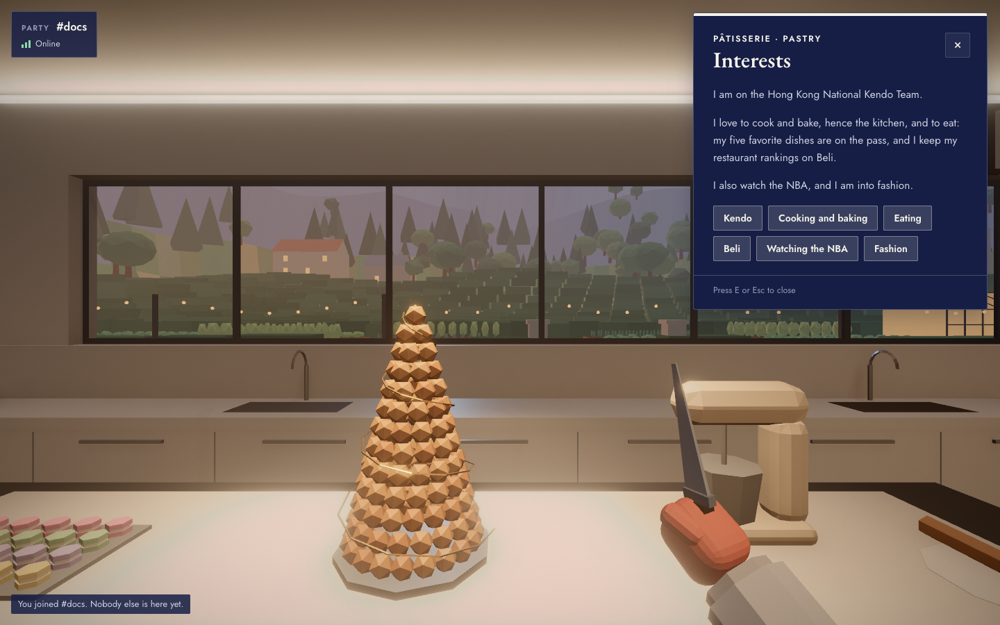
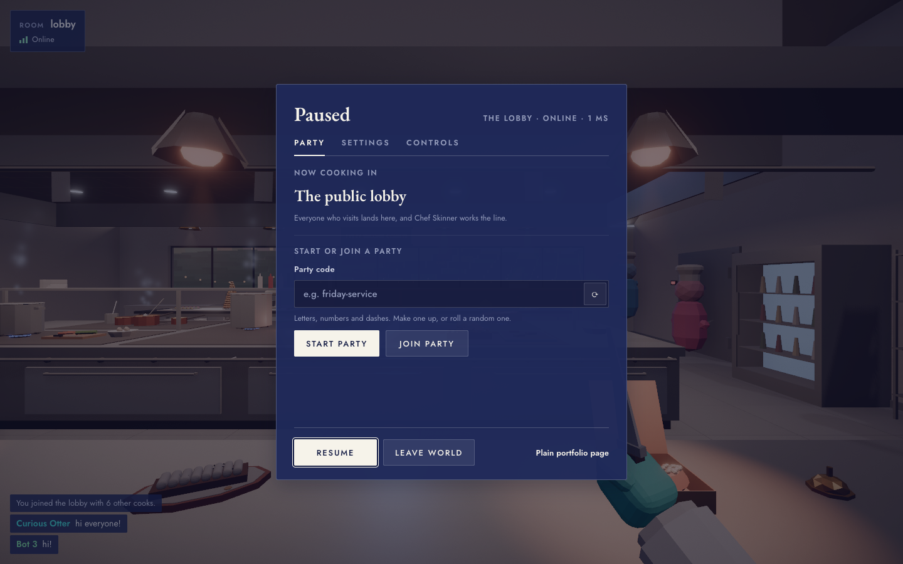
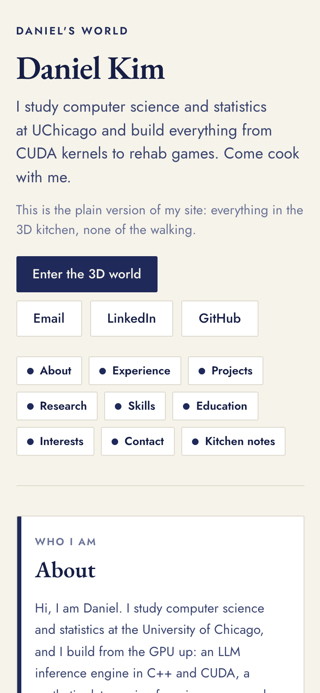
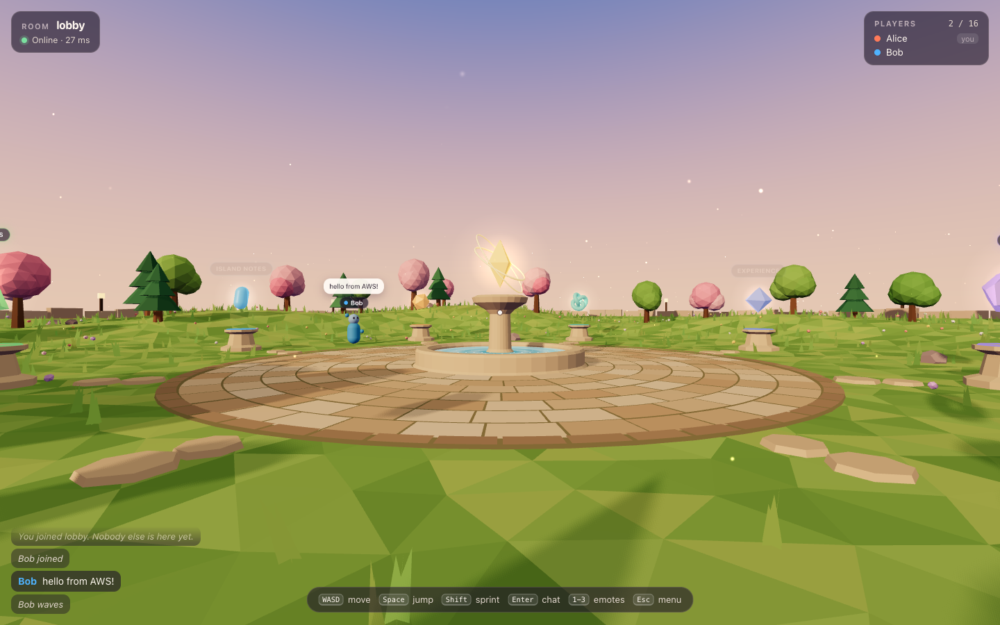
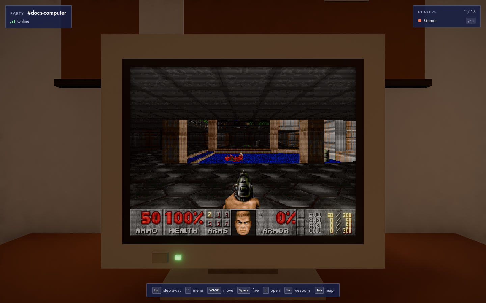

# Daniel's World

A personal website that is a small multiplayer 3D world.
Visitors walk a low-poly three-star kitchen, laid out after the French Laundry, in first person, click its stations to learn about Daniel, and see everyone else who is visiting as a cook in a toque with a name tag.
There is also a plain [portfolio page](apps/client/portfolio.html) with the same content, for phones, browsers without WebGL, and anyone in a hurry.

**Live:** https://d1ivv0s5bbzyx0.cloudfront.net (AWS: CloudFront, S3, EC2) and https://daniel-world-nine.vercel.app (Vercel front end on the same AWS room server).

Everything also runs locally: no accounts, no API keys, no paid services, no downloaded models or textures.



| World, with other visitors                  | Info panel                                          |
| ------------------------------------------- | --------------------------------------------------- |
|  |       |
|    |  |

## Quick start

Requires Node.js 22.18 or newer (the server runs TypeScript natively in development).

```bash
npm install
npm run dev
```

Open http://localhost:5173.
The room server listens on :3001.
Open a second browser window to see yourself from the outside.

## Controls

| Key     | Action                                                      |
| ------- | ----------------------------------------------------------- |
| W A S D | Move (arrow keys work too)                                  |
| Mouse   | Look around (click the world to lock)                       |
| Space   | Jump                                                        |
| Shift   | Sprint                                                      |
| Click   | Throw a knife, or punch with the bare hand (hold to repeat) |
| Q       | Switch between knife and bare hand                          |
| I       | Inspect the knife                                           |
| E       | Open the station you are looking at                         |
| Enter   | Chat (120 characters, plain text)                           |
| Esc     | Menu                                                        |

Leave the private party field empty to join the public `lobby`, or type a code to join or start a private party, a kitchen of your own.
The menu's Party tab does the same without leaving the world: start a party with your own code or a random one, join one by its code, or head back to the lobby.
In a party it shows the invite link (`/?room=<code>`) with a Copy link button, and the address bar keeps the party, so a reload or the shared address comes back to it.
Chef Skinner stays in the lobby.

Every cook carries knives, in every room.
Left click to throw one; it flies in a slight arc and sticks into whatever it hits.
A knife that hits another cook knocks them out for three seconds, then they get back up somewhere else, briefly protected.
The newest 60 knives stay stuck around the kitchen until everyone leaves the room.

## Editing the content

All personal content lives in [`apps/client/src/content.ts`](apps/client/src/content.ts).
It holds Daniel's resume, item by item: each role and project is written once and shared by the portfolio page (the `lore` sections) and the kitchen's eight stations (`stations`), so a change shows up in both.
Each station serves one part of it, and its label says which: the pass is About me, the saucier Experience, the rôtisseur and entremetier the projects, the poissonnier Research, the garde manger Skills, the pâtisserie Interests, and the plonge Education and contact.
The few lines that still want Daniel's own words are marked `TODO(daniel)`.

## Scripts

| Command                          | What it does                                                                  |
| -------------------------------- | ----------------------------------------------------------------------------- |
| `npm run dev`                    | Client (Vite, :5173) and server (:3001) with reload                           |
| `npm run build`                  | Server bundle in `apps/server/dist`, static site in `apps/client/dist`        |
| `npm start`                      | Run the built server                                                          |
| `npm run lint`                   | ESLint (type-aware) and Prettier check                                        |
| `npm run typecheck`              | TypeScript in every workspace                                                 |
| `npm test`                       | Vitest unit and integration tests                                             |
| `npm run e2e`                    | Playwright end-to-end tests (run `npx playwright install chromium` once)      |
| `npm run bots -- --count 15`     | Simulated players wandering the lobby                                         |
| `node scripts/screenshots.ts`    | Regenerate `docs/screenshots/`                                                |
| `node scripts/perf.ts`           | 16-player performance check (needs the dev client running)                    |
| `node scripts/computer-bench.ts` | Kitchen computer benchmark: DOOM's timedemo, guest MIPS and frames per second |

## How it works

The repository is an npm workspaces monorepo.

- `packages/shared` holds everything client and server must agree on: the zod message protocol, constants, the world layout and its colliders, and a deterministic movement simulation.
- `apps/server` is a Node WebSocket server (`ws`).
  Rooms live in memory, hold up to 16 players, and disappear when empty.
- `apps/client` is Vite, TypeScript and Three.js, with plain DOM and CSS for the interface.

Networking follows the usual pattern for fast-paced games:

- Clients send one input per tick (60 Hz) and predict their own movement with the shared simulation, so movement feels instant; the camera is drawn between the last two ticks, so it is smooth.
- The server runs the same simulation at 60 ticks per second and broadcasts snapshots 20 times a second.
  When a snapshot arrives, the client rewinds to the server's state and replays inputs the server has not seen yet.
  Because the simulation is deterministic and quantized, this lands exactly where prediction was.
- Other players are drawn about 100 ms in the past, interpolated between snapshots.
- Every inbound message is validated with the shared schemas.
  The server rate limits each connection, disconnects floods, drops dead connections with a heartbeat, caps connections per IP, and only simulates one input per tick per player, so speed hacks do not work.
- If the server is unreachable, the world keeps working in single-player mode and reconnects in the background.

Rendering is built for a smooth 60 fps with a full room:

- The static kitchen is merged into one mesh per material, about a dozen draw calls for every pot, knob and tile.
- Avatars are instanced, and ambient motion (gas flames, steam) runs in shaders.
- The look is low-poly: flat-shaded facets and plain colors, with no textures to sample and no reflections to compute.
- Name tags are DOM elements rather than extra draw calls.
- Software renderers (no GPU) automatically get a lighter quality tier without shadows or accent lights.
  `?quality=high` or `?quality=low` overrides the choice.



Measured with `node scripts/perf.ts` on an Apple M5 laptop with 16 players in one room throwing knives, on the high tier: a steady 60 fps, about 2.2 ms of main-thread time per frame, 74 draw calls (about 30 of them post-processing passes), 123k triangles, and no prediction corrections.

## The kitchen computer

The beige PC on the chef's desk, in the south-west corner, runs the original DOOM (press E at it; Esc steps away, the backquote key opens DOOM's menu).
It is not a port to the browser but a small computer of its own:



- **A RISC-V (RV32IM) CPU emulator in TypeScript** (`apps/client/src/computer/`), with 32 MiB of RAM and memory-mapped devices: a 320x200 8-bit framebuffer and palette, a keyboard queue, a millisecond timer, a console and a disk window holding the WAD. The ABI is one header, `firmware/include/machine.h`, mirrored in `abi.ts` and checked by a test.
- **DOOM cross-compiled bare metal for it** (`firmware/`): the vendored `doomgeneric` (GPLv2) with a platform layer for those devices, a freestanding libc written for it (strings, a malloc over the linker script's heap, printf and scanf as far as DOOM needs, 64-bit division, an in-memory file system with the WAD mounted read-only), `crt0.S` and a linker script that leaves page 0 unmapped so null pointers fault.
- **Two engines**: a reference interpreter, and a JIT that compiles regions of RISC-V into JavaScript functions, guest registers in locals and self-loops as native loops. Measured in Chromium on an Apple M5, the JIT runs DOOM's timedemo at about 3.2 billion guest instructions a second (the interpreter about 180 million); live play needs under 40 million, about 2% of a core. It runs in a Web Worker, so the kitchen's frame budget is untouched.
- **Tested against the official riscv-tests** (rv32ui and rv32um) on both engines, by differential testing of the JIT against the interpreter on random programs, and by booting the real DOOM: its title screen matches TITLEPIC decoded straight from the WAD, pixel for pixel.

The firmware is committed prebuilt (`apps/client/src/computer/assets/doom.elf`), since the site's builds have no RISC-V toolchain. To rebuild it: `brew install llvm lld`, then `firmware/doom/build.sh` (the build is reproducible). The ELF is GPL, as `doomgeneric` is; its source is everything under `firmware/`. `doom1.wad` is the unmodified, freely redistributable shareware release.

Judgment calls made while building are recorded in [DECISIONS.md](DECISIONS.md).

## Deployment

The site has two parts with different hosting needs.
The client is static files.
The room server is a long-running process that holds WebSocket connections and the in-memory rooms, so it cannot run on serverless functions (Vercel, Lambda).

### AWS (primary): one command with the CDK

`infra/` defines the whole production stack with the AWS CDK in TypeScript:

```text
visitor ──HTTPS──▶ CloudFront ─┬─ /*    ──▶ S3 bucket (private, Origin Access Control)
                               └─ /ws*  ──▶ EC2 t4g.micro room server (Graviton, port 3001)
```

- **CloudFront** is the only public entry point.
  It serves the site and proxies WebSocket traffic on the same domain, so the page connects to `wss://<same host>/ws` with CloudFront's TLS certificate and no custom domain is required.
- **S3** holds the built client; the bucket is private, encrypted, and readable only by the distribution.
  Every deploy uploads the new build and invalidates the cache.
- **EC2** runs the server bundle under systemd as an unprivileged user, on a pinned and checksum-verified Node.js.
  Its security group accepts only CloudFront's origin-facing IP ranges on port 3001; there is no SSH, and shell access goes through **Systems Manager Session Manager**.
  A new server build replaces the instance (immutable deploys).
- **CloudWatch** receives the server logs (two-week retention) and two alarms self-heal the instance: host failure triggers EC2 auto-recovery, an unresponsive instance is rebooted.
- **IAM** is least privilege: the instance role has Session Manager access, read access to its own code bundle, and write access to its own log group.
- No NAT gateway and a single public subnet keep the cost to roughly the instance and its public IP (about $10/month, less on the AWS free tier).

First time only:

```bash
aws login                                         # or aws configure / aws sso login
npx cdk bootstrap -a "node infra/bin/world.ts"    # prepares the account for CDK deploys
```

Then deploy (and redeploy after changes) with:

```bash
npm run deploy:aws
```

The command builds the client (pointed at `/ws`) and the single-file server bundle, then runs `cdk deploy`.
It prints `SiteUrl` (the site), `ServerUrl` (for a client hosted elsewhere), `ShellCommand` (Session Manager) and `ServerLogGroup`.
`npm run diff -w @world/infra` previews changes; `npm run destroy -w @world/infra` removes everything.
Rooms live in one process's memory, so keep exactly one instance.

### Vercel (optional second front end)

`vercel.json` builds the static client for Vercel.
To give it multiplayer, set the project's `VITE_SERVER_URL` environment variable to the stack's `ServerUrl` output (for example `wss://d1234abcd.cloudfront.net/ws`) and redeploy.

### Other hosts

The server is one file with no runtime dependencies besides Node.js 22+:

```bash
npm ci && npm run build -w @world/server
PORT=8080 TRUST_PROXY=1 node apps/server/dist/index.js
```

Environment variables (see [`apps/server/.env.example`](apps/server/.env.example)): `PORT`, `ALLOWED_ORIGINS` (comma-separated page origins; unset allows any), `TRUST_PROXY=1` behind a proxy, and `BASE_PATH` when a CDN forwards a path prefix such as `/ws`.
Railway or Render work with build command `npm ci && npm run build -w @world/server`, start command `node apps/server/dist/index.js`, and health check `/health`.
Build the client with `VITE_SERVER_URL` set to the server's `wss://` URL, or to a path like `/ws` when the same domain proxies to the server.

## Testing

- Unit and integration tests (Vitest) cover the simulation, protocol validation, rate limiting, rooms, the WebSocket server, prediction and interpolation.
- End-to-end tests (Playwright, Chromium with SwiftShader software WebGL) open several browser contexts and assert on a read-only `window.__world` debug object that exists only in dev and test builds.
  They cover lobby presence, movement replication, chat, private room isolation, leaving, the info panel, and offline play with automatic reconnection.
