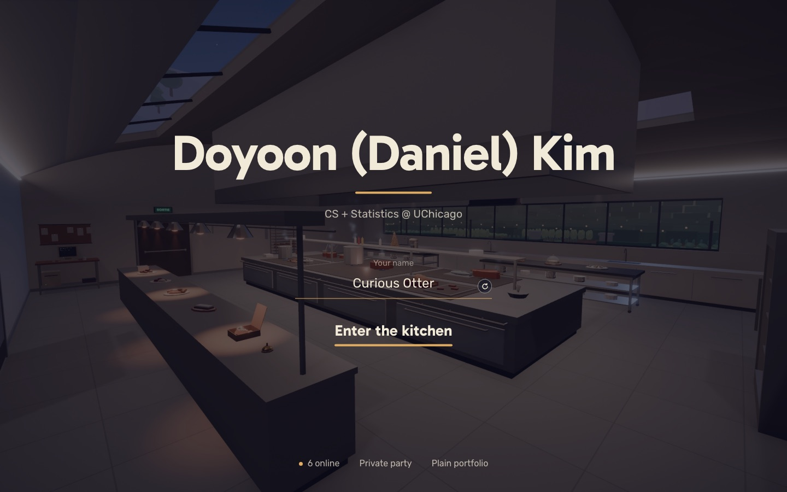
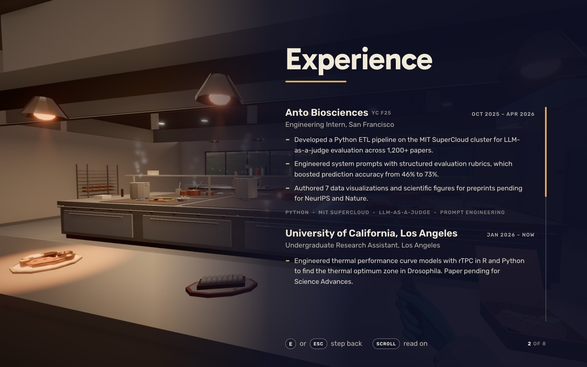
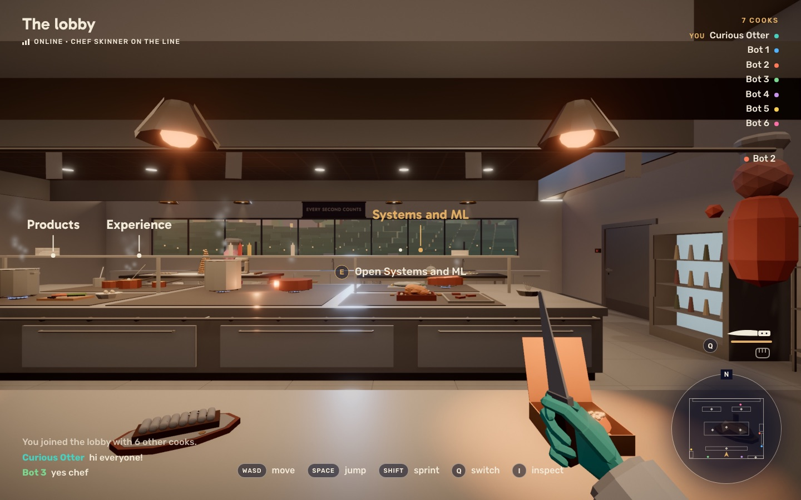
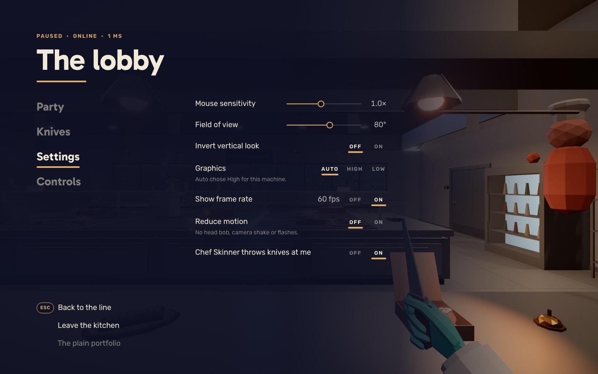

# The interface revamp

The interface used to be one navy box for everything, which read as generated.
This is the system that replaces it, approved by Daniel on 2026-10-08 from the mockups in `docs/ui-revamp/`.
It follows how the games and 3D sites that do this well keep every screen consistent: Clair Obscur's pause menu, Disco Elysium's reading column, Heaven's Vault's labels, the Cartier site's prompts.

The mockups are static HTML over real frames of the kitchen at 8 p.m.; build to them, then judge the real thing in the running game.

## The rules

1. **No boxes.**
   Reading surfaces (landing, station panel, pause menu) sit on a side of the screen darkened like the blue hour, or on an even dim of the whole view.
   Nothing else gets a panel, a card, a chip or a pill.
2. **Nothing behind or around words in the world.**
   No outlines, no text strokes, no glows, no `text-shadow`, no gradient pools behind labels.
   Legibility comes from weight, size and color, and from where things sit.
3. **Two typefaces.**
   Gabarito 700 (`--font-display`) for titles, labels in the world and the one main action of a screen.
   Rubik 400 to 700 (`--font-body`) for everything else.
   No serifs, nothing hand-drawn.
   The fonts' latin subset has no arrows, so draw them (SVG or CSS) instead of typing them.
4. **One accent.**
   Brass (`--accent`, `#e0ad62`) only for what is current or can be acted on: the equipped knife, the chosen setting, the station under the crosshair, the field you are typing in, the player who is you.
5. **One mark.**
   A short rounded brass bar (`.bar`, `--bar` thick) under whatever is current: a title, the current tab, the chosen option, a hovered or primary button.
6. **Keys are rings.**
   Every `<kbd>` is a ring: a circle round one letter, a capsule round a word.
   Icon buttons are rings too (`.icon-button`).
7. **The house navy is the dark**, `--night`, that everything sits in, never a fill.
8. **Plain words.**
   No slogans, no flavor text, no uppercase field labels, no kickers that repeat what the title says.
   Say what a thing is or does, in as few words as it takes.
9. **No French station names in the game.**
   Labels, panels and prompts name the resume section only (Experience, Products, Systems and ML...).
   The French names are only the stations' ids, with a comment by each in `content.ts`; the portfolio page names the sections too.

## Tokens and parts

All in `apps/client/src/styles/tokens.css` and `controls.css`; use them, do not re-invent them per surface.

- Colors: `--night` (and `--night-rgb` for alpha), `--ink` (ivory text), `--ink-muted`, `--ink-faint`, `--ink-hair` (hairlines and tracks), `--accent` (brass), `--danger`, `--ok`, `--warn`.
- Darks: `--dark-from-left`, `--dark-from-right` (gradients for a reading side), `--dim` (an even dim of the whole view).
- `.kicker`: a small uppercase line in brass above a title, only where it adds information (a status, a count).
- `.title`: the display face; each surface sets the size.
- `.bar`: the brass mark.
- `.button`: a word with the bar sliding in under it on hover or `aria-current`; `.button-primary` always has the bar; `.button-large` is the screen's main action in the display face.
- `.icon-button`: a ring.
- `.field`, `.field-label`, `.field-help`, `.input`: a line to write on that turns brass while you type; labels in plain case.
- `kbd`: a ring.

The old navy tokens (`--navy`, `--panel`, `--panel-border`, `--radius*`, `--shadow`, `.card`) are gone; do not bring them back.

## Surfaces

### Landing (`ui/landing.ts`, `styles/landing.css`, `game/landingCamera.ts`)

Centered, over an even `--dim` of the whole view:

- "Doyoon (Daniel) Kim" in the display face, the bar, then "CS + Statistics @ UChicago".
- The name field (label "Your name" in plain case, the reroll as a ring inside the line).
- One main action, "Enter the kitchen" (`.button-large`, no key ring beside it).
- One quiet row at the bottom: the online count with a brass dot, "Private party" (a disclosure that opens the party code field; it opens by itself when the link carries a room), and the plain portfolio link.
- Notices (touch devices, no WebGL, kicked back to the landing) are one plain line of text, not a box.
- On a touch-only device, and where the world cannot run (no WebGL, or it failed to load), "View the portfolio" is the main action, in the display face with the bar; on a touch device "Enter the kitchen" stays, as a quiet button under the name.

Behind it the camera moves slowly through the kitchen: a closed loop through the aisles round the cooking suite, at about head height, looking ahead and a little in toward the suite, about two minutes a lap.
It must not allocate per frame, must not pass through fixtures, and holds the old still establishing shot when motion is reduced.
The swoop into the game starts from wherever the camera is.

The loading screen matches: the name centered, a thin brass bar for progress, the status line under it.

### Station panel (`ui/panel.ts`, `ui/loreContent.ts`, `styles/panel.css`)

A column docked to the right edge on `--dark-from-right`, the station still in view on the left.
The title is the section (display face, large) with the bar under it; no kicker, no station name.
Entries: the name in Rubik 600, dates on the right in small uppercase, the role on its own line in `--ink-muted`, points with short brass dashes, the stack as one line of small uppercase words split by middle dots (never pills).
The column scrolls natively with a thin brass scrollbar; no fades.
A ring close button at the top right of the column; the footer says "E or Esc to close" with ring keys, and which section of how many this is.
On narrow screens the column takes the full width on an even dark.

### Labels and name tags in the world (`ui/labels.ts`, `styles/labels.css`, `styles/nametags.css`)

A station label is only the section title in the display face, plain ivory, with a thin leader line and a small pin down to the station.
The label under the crosshair turns brass.
Name tags are the player's name in Rubik 500 with a dot of their color.
Nothing behind or around any of it.

### HUD (`ui/hud.ts`, `chat.ts`, `toast.ts`, `killFeed.ts`, `knockout.ts`, `impact.ts`, `computerGuide.ts`, their styles)

- Top left: the room name in the display face, and under it the signal bars and the connection word (Online, Connecting, Solo).
- Top right: the players, right-aligned, each with a dot of their color; yours marked "you" in brass.
- The prompt under the crosshair: a ring key and the action ("Open Products", "Play DOOM"); its accessible text stays a full sentence.
- Bottom center: the controls hint as ring keys and words.
- Bottom left: chat as plain lines, names in their color and weight 700, system lines in full ivory; the chat input is a line to write on.
- Toasts and the kill feed: plain lines, no chips.
- Knocked out: the flat veil stays; the card becomes a kicker and the name in the display face, no box.
- The computer guide: plain rows of ring keys and words.

### Loadout and minimap (`ui/loadout.ts`, `ui/minimap.ts`, `styles/loadout.css`, `styles/minimap.css`)

Bottom right.
The minimap is a round disc of `--night` with an `--ink-faint` ring and an "N" tab on top, the kitchen drawn in ivory line, stations as small diamonds, players as dots of their color, you as a brass arrow.
Above it the loadout: the knife over the fist, Q as a ring beside the pair, a brass bar under what is in hand; the knife's readiness after a throw still shows.
No panel behind the loadout; if the icons vanish on the brightest walls, give each a small night disc like the map rather than a box.

### Pause menu (`ui/pause.ts`, `party.ts`, `knivesPanel.ts`, `knifePreview.ts`, `styles/pause.css`)

On `--dark-from-left`:

- A kicker with the status ("Paused · Online · 1 ms"), the room as the title, the bar.
- The tabs as a vertical list of words in the display face; the current one in ivory with the bar, the rest faint.
  Arrow keys move between them both ways.
- The tab's content to the right: rows of a label (with help text under it in `--ink-faint`) and a control on the right.
- Sliders: a hairline track, a brass run and a ringed knob.
- Switches stay `role="switch"` but read as "Off On" with the bar under the current word.
- Choices (graphics) are words with the bar under the chosen one.
- Bottom left: Resume with its Esc ring, Leave the kitchen, and the Plain portfolio link.
- Party, Knives and Controls follow the same rows, words and rings; the knife grid is icons and names with the bar under the equipped one, no tiles.
- The dialog's accessible name stays "Paused".

### Portfolio page (`portfolio.ts`, `styles/portfolio.css`)

The same system for the plain page: the night background, Gabarito titles with the bar, Rubik text, entries as in the station panel, links as text links, the stack as dotted words, no boxes or pills.

## Checking

- `npm run lint && npm run typecheck && npm test`, and `npm run e2e` for anything a test drives.
- Accessible names the tests rely on change only where this spec changes the words (the landing heading and its main button, the prompt's visible text); update the tests and `scripts/screenshots.ts` with them.
- Look at the real thing: `node scripts/screenshots.ts` (real GPU, `?quality=high&time=20:00`), and check at least one bright view and a 390 px phone for anything on the landing or the portfolio.
